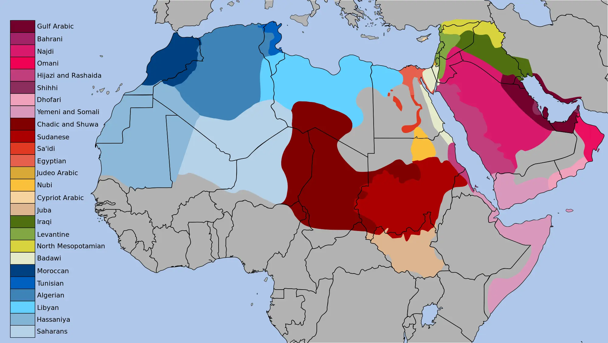

# (PART) 理論編 [WIP] {.unnumbered}

# アラビア語 {#theory_arabic}

## 口語と標準語 {#coll_n_msn}

ご存知の通り（ご存知でない方は新たなことを知る機会!）、アラビア語は、

-   標準語 フスハー（Ar: الفصحى, En: Modern Standard Arabic, MSA）
-   口語あるいは方言 アーンミーヤ（En: Spoken Arabic, Colloquial Arabic, dialect）

の2つの種類があり、お互いの乖離が非常に激しい。

## 標準語について {#msn}

標準語は、クルアーンで使用されている7世紀の古典アラビア語を後世の文法学者らが体系化・規範化した言語である。英語でModern Standard Arabicと呼ばれるように、古典語を現代化したものとも言える。標準語は、国・地域が異なっても文法や語彙、発音のルー ルが同じであり、どこの国でも同じように使用できる[^02-theories-1]。

[^02-theories-1]: ただし、発音については、方言に引きずられる傾向にある。子音さえ合っていれば通じるのだろう。

使用場面から見てもわかる通り、標準語は「お硬い」言葉だ。アラブ人の感覚を日本人にもわかるような表現にすると、標準語は戦前の新聞や公文書、文豪が使用したような言葉と言えばよいだろうか。

例えば、明治・大正期の小説家、森鴎外の『舞姫』の冒頭は以下の通りである。

> 石炭をば早や積み果てつ。中等室の`r rmdja::ruby("卓", "つくゑ")`のほとりはいと靜にて、`r rmdja::ruby("熾熱燈", "しねつとう")`の光の晴れがましきも`r rmdja::ruby("徒", "いたづら")`なり。今宵は夜毎にこゝに集ひ來る`r rmdja::ruby("骨牌", "かるた")`仲間も「ホテル」に宿りて、舟に殘れるは余一人のみなれば。

次に明治憲法の一部を見てみよう。

> 第１条: 大日本帝国ハ万世一系ノ天皇之ヲ統治ス

このように、我々現代日本人からすれば、難解で読むのに一苦労するような言葉である。このような言葉を、日本では「文語」と表現されるが、日本の文語の成立と標準語アラビア語のそれはかなり類似している。文語は、平安時代の日本語文法・語彙を根幹として成立したためだ。

## 口語について {#coll}

# 記憶の科学 {#distr_learn}

人の
